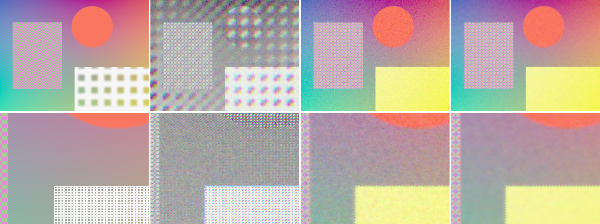

# RawForge

[](https://github.com/colenator123-design/rawforge-cpp-isp/actions/workflows/ci.yml)


**High-Performance C++ Quad-Bayer Remosaic & RAW Denoising Pipeline**

RawForge 是一套以 C++20 從零實作的 RAW image processing prototype。它把帶有感光雜訊的 Quad-Bayer RAW 轉換成標準 Bayer RAW，讓後續 ISP 可以執行 demosaicing、white balance 與 color processing。專案題目取自 MIPI 2022 Quad Joint Remosaic and Denoise Challenge，但程式、測試影像與 benchmark 都能獨立重現，不需要下載受限制的官方資料。

第二版在 **8 個未參與調參的合成場景**上，medium noise 平均提升 **+0.379 dB PSNR / +0.0245 SSIM**，high noise 平均提升 **+0.758 dB / +0.0449 SSIM**；640×480 joint pipeline latency 從第一版的 121.47 ms 降至 **59.67 ms（-50.9%）**。

## 結果展示



由左到右分別是 clean RGB ground truth、錯誤地直接顯示 noisy Quad-Bayer、remosaic-only baseline，以及 noise-adaptive denoise + remosaic。下排是同一區域的放大圖，方便觀察平滑區域的彩色顆粒和高反差邊緣。

> 圖片是固定 random seed 的合成案例；下方多場景表格才是用來比較演算法的主要結果。

## 公開問題來源

MIPI 2022 的任務是把 Quad CFA interpolation 成 full-resolution Bayer，並同時處理 RAW noise。官方資料包含 70 個 training scenes、15 個 validation scenes，以及 0／24／42 dB 三種 noise levels；評估指標包括 PSNR、SSIM、LPIPS 與 KLD。

- [MIPI 2022 官方 repository](https://github.com/mipi-challenge/MIPI2022)
- [Quad-Bayer Challenge report](https://arxiv.org/abs/2209.07060)
- [CodaLab Challenge](https://codalab.lisn.upsaclay.fr/competitions/4955)

競賽已結束，官方資料需要登入並同意研究用途條款。本 repository 只提交自行產生的合成 RAW 與程式碼，不重新發布官方影像，也不把下列結果宣稱為官方 leaderboard 成績。

## 問題與 Pipeline

一般 RGGB Bayer 每個 `2×2` 區塊包含 R、G、G、B；Quad-Bayer 則把相同顏色排列成 `2×2` block：

```text
Standard Bayer       Quad-Bayer
R G R G              R R G G
G B G B              R R G G
R G R G              G G B B
G B G B              G G B B
```

Quad-Bayer 有利於 low-light pixel binning，但不能直接交給預期標準 Bayer pattern 的 ISP。RawForge 的可重現流程如下：

```text
Linear RGB ground truth
        ├── Standard Bayer ───────────────── Evaluation target
        └── Quad-Bayer
               ↓
        Poisson-Gaussian noise
               ↓
      Noise-adaptive same-color denoise
               ↓
       Full-resolution remosaic
               ↓
          Standard Bayer
               ↓
       Bilinear demosaic preview
```

### Signal-dependent noise

合成 sensor noise 同時包含固定 read noise 和隨訊號變化的 shot noise：

```text
sigma(pixel) = read_sigma + shot_scale × sqrt(signal)
noisy_pixel  = clamp(signal + sigma × N(0, 1))
```

固定 random seed 讓相同輸入可完全重現。

### Noise-adaptive same-color denoise

Bilateral filter 只取樣相同 Quad CFA color 的鄰居，避免直接混合 R、G、B sensor measurements。第二版不再對所有亮度使用固定 range threshold，而是依中心像素估計局部雜訊：

```text
estimated_sigma = read_noise + shot_noise × sqrt(center)
range_sigma     = multiplier × estimated_sigma
weight          = spatial_weight × range_weight
```

因此高雜訊區會獲得較強抑制，低雜訊與高反差邊緣則較不容易被抹平。

### Full-resolution remosaic

每個輸出位置先查詢標準 RGGB Bayer 應有的顏色。若 Quad CFA 該位置已經是相同顏色就保留量測值，否則只使用附近同色 samples 做距離加權插值。

## 多場景品質驗證

參數搜尋只使用 synthetic variants 0–5；以下結果使用完全分開的 held-out variants 6–13，並在 low、medium、high 三組 read/shot noise profile 上評估。每格是 8 個場景的平均值。

| Noise | Baseline PSNR | Restored PSNR | PSNR gain | Baseline SSIM | Restored SSIM | SSIM gain |
|---|---:|---:|---:|---:|---:|---:|
| Low | 19.9853 | 20.0628 | +0.0775 dB | 0.8512 | 0.8566 | +0.0054 |
| Medium | 19.5629 | 19.9423 | **+0.3794 dB** | 0.8244 | 0.8489 | **+0.0245** |
| High | 18.8091 | 19.5670 | **+0.7580 dB** | 0.7812 | 0.8261 | **+0.0449** |

完整數據位於 [`benchmarks/quality_multiscene.csv`](benchmarks/quality_multiscene.csv)。結果符合預期：低雜訊時演算法只做小幅修正，雜訊越高，adaptive denoise 的效益越明顯。

調參工具會搜尋 filter radius、spatial sigma 與 range multiplier。它與 held-out benchmark 分離，避免直接拿測試場景挑參數：

```bash
./build/rawforge_tune
./build/rawforge_quality_benchmark
```

## 實測效能

Release build，Apple M3 CPU。第二版預先計算 spatial weights，並以 portable `std::thread` 將影像 rows 分區平行處理。

| Resolution | Megapixels | Remosaic baseline | Joint pipeline | Joint ms/MP | PSNR gain |
|---:|---:|---:|---:|---:|---:|
| 320×240 | 0.0768 | 4.98 ms | 16.02 ms | 208.59 | +0.117 dB |
| 640×480 | 0.3072 | 19.85 ms | **59.67 ms** | 194.25 | +0.117 dB |
| 1280×720 | 0.9216 | 59.81 ms | 175.97 ms | 190.94 | +0.116 dB |

完整數據位於 [`benchmarks/apple_m3_release.csv`](benchmarks/apple_m3_release.csv)。每個數值取一次 warm-up 後 7 次執行的中位數。速度測試固定使用高頻 synthetic scene，目的是量 latency；品質結論請以上一節的多場景測試為準。相較第一版同機器 640×480 的 121.47 ms，目前 latency 降低約 **50.9%**。

## Build and Run

需求：支援 C++20 的 compiler、CMake 3.20 以上，以及 Python 3（只用於產生 README 比較圖）。核心 pipeline 不依賴 OpenCV。

```bash
git clone https://github.com/colenator123-design/rawforge-cpp-isp.git
cd rawforge-cpp-isp

cmake -S . -B build -DCMAKE_BUILD_TYPE=Release
cmake --build build --parallel
ctest --test-dir build --output-on-failure
```

產生 demo 輸出與比較圖：

```bash
./build/rawforge_demo outputs/demo
python3 scripts/make_comparison.py
```

執行效能、多場景品質與參數搜尋：

```bash
./build/rawforge_benchmark
./build/rawforge_quality_benchmark
./build/rawforge_tune
```

## 專案結構

```text
rawforge-cpp-isp/
├── include/rawforge/
│   ├── image.hpp       # Contiguous generic image buffer
│   ├── cfa.hpp         # Quad-RGGB and Bayer-RGGB layouts
│   ├── pipeline.hpp    # Adaptive denoise, remosaic, demosaic API
│   ├── synthetic.hpp   # Multi-scene charts and sensor noise
│   ├── metrics.hpp     # MSE, PSNR and SSIM
│   └── io.hpp          # PGM / PPM output
├── src/                # C++ implementations
├── apps/
│   ├── demo.cpp
│   ├── benchmark.cpp
│   ├── quality_benchmark.cpp
│   └── tune.cpp
├── tests/test_main.cpp
├── scripts/make_comparison.py
└── benchmarks/
```

## 測試與工程品質

- Quad-RGGB 與 Bayer-RGGB CFA mapping
- Constant RAW 經 denoise／remosaic 後保持不變
- Joint pipeline 必須優於 remosaic-only baseline
- 固定 seed 必須產生相同 sensor noise
- MSE、PSNR、SSIM identity checks
- Ubuntu GitHub Actions 會 build、執行 CTest、demo 與 multi-scene benchmark

可另外啟用 AddressSanitizer 與 UndefinedBehaviorSanitizer：

```bash
cmake -S . -B build-asan \
  -DRAWFORGE_ENABLE_SANITIZERS=ON \
  -DCMAKE_BUILD_TYPE=Debug
cmake --build build-asan --parallel
ctest --test-dir build-asan --output-on-failure
```

## 技術重點

- C++20、RAII、contiguous image storage
- CFA-aware neighborhood sampling 與 RAW-domain bilateral filtering
- 依 read/shot noise 自適應的 range threshold
- 預先計算 kernel weights 與 portable CPU multithreading
- PSNR／SSIM multi-scene evaluation 與 train/held-out split
- CMake、CTest、sanitizers、GitHub Actions

## Roadmap

1. Cache tiling 與減少重複 CFA 計算
2. Apple Silicon ARM NEON SIMD kernels
3. 以 regression benchmark 驗證的 edge-directed interpolation
4. 讀取 10／12／14-bit packed RAW
5. MIPI 官方資料 adapter 與 LPIPS／KLD evaluation
6. ONNX Runtime C++ learned residual refinement

## License and Data Policy

RawForge 程式碼使用 MIT License，與 MIPI Challenge 主辦單位無隸屬關係。MIPI datasets 僅限學術研究及非商業用途，且不得重新散布；請從官方 CodaLab 頁面申請與下載。
